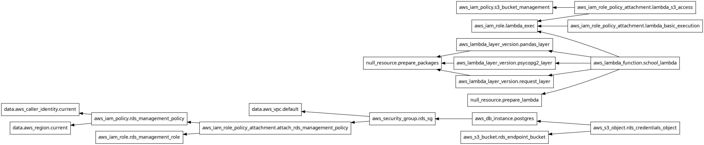
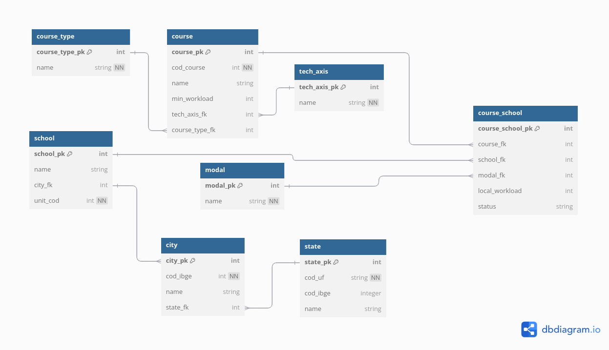

# Data Engineering - AWS RDS/Postgres &Terraform

This project aims to build a scalable and reusable data pipeline using AWS RDS/Postgres, Terraform, and Python to create a model database for technical schools in Brazil.

## AWS Tools
The following AWS services are used in this project:

-   **AWS CLI**: For managing credentials
-   **RDS**: To create and maintain the Postgres Database
-   **Lambda**: To create tables and load the data
-   **Layers** - To keep the python libraries
-   **IAM**: To handle authorizations
-   **CloudWatch**: For logging
-   **S3**: To store code and data

## Terraform
The project is divided into modular Terraform files:

- **`main.tf`**:  Contains the main resources for AWS setup, including VPC, Security Groups, RDS instance, S3 objects, Lambda Layers, and Lambda Function. 
- **`output.tf`**: Defines variables to output the process results. 
- **`providers.tf`**: Specifies the providers used in the project. 
- **`variables.tf`**: Contains variable definitions, with some marked as sensitive. 
- **`terraform.tvars`**: Specifies non-default variable values. 
- **`zipfile.tf`**: Commands to compress files (layers and code). 
- **`iam.tf`**: Manages secure access policies for AWS services.

## Data

 The data is sourced from **Brazil's Ministry of Education and Culture (MEC)** and focuses on identifying technical high schools that combine general secondary education with vocational training in various fields. 

**Pro Tip:** Access the dataset from the official MEC API at: [Regulação de Cursos - MEC API](https://olinda.mec.gov.br/olinda-ide/servico/PDA_SETEC/versao/v1/odata/Regulacao_Cursos)

## Database Schema

The database is designed to organize and store information about technical schools, courses, and locations. Below are the main tables: 

- **Course Type**: Contains information about the type of educational courses offered. Example: `'Técnico'`, identifying secondary-level technical education programs. 
- **Tech_Axis**: Defines valid technological areas for `Course Type`. Examples: Cultural Production and Design, Games.
- **Modal**: Contains information about course delivery modality (e.g., in-person, distance learning). 
- **State**: Contains information about Brazilian states (e.g., name, IBGE code, flag). Example: SP - São Paulo - 35. 
- **City**: Contains information about cities (e.g., name, state, IBGE city code). Example: São Paulo - SP - 3550308. 
- **Course**: Contains details about courses offered by schools (e.g., Pós-Colheita, Técnico em Grãos, Mecatrônica).
-  **Schools**: Contains names and details of technical schools. Example: CENTRO DE EDUCAÇÃO PROFISSIONAL E TECNOLÓGICA EM DESIGN. 
- **Course_School**: Maps courses to schools, cities, and states.

## Code

The project includes the following Python scripts: 
- **create.py**: Contains the main handler and pipeline logic. 
- **ddlSQL.py**: Defines the database schema (DDL statements). 
- **load.py**: Handles the process of loading data into the tables. 
- **rebuild.py**: Drops and recreates tables as needed. 

### Requirements 
- **pandas.txt**: Specifies requirements for the Pandas package. 
- **requirements.txt**: Specifies other dependencies for the code. ---

## Run
 Follow these steps to set up and run the project: 
 1. **Install Terraform**: Follow the [HashiCorp Terraform installation guide](https://developer.hashicorp.com/terraform/tutorials/aws-get-started/install-cli). 
 2.  **Install AWS CLI**: Use the AWS CLI for credential management. 
 3. **Initialize Terraform**: Run `terraform init` in the project directory. 
 4. **Apply Terraform**: Deploy the infrastructure with `terraform apply`. 
 5. **Invoke Lambda**: Use the AWS Console to execute the Lambda function. 

**Pro Tips:** 
- Use PyCharm IDE to configure and run SQL queries to verify the data. 
- Refer to the [HashiCorp Terraform documentation](https://developer.hashicorp.com/terraform/docs) for more commands and details. 

## Next Steps 
- Perform data quality checks. 
- Configure an API to expose the data. 
- Automate further testing and monitoring.

